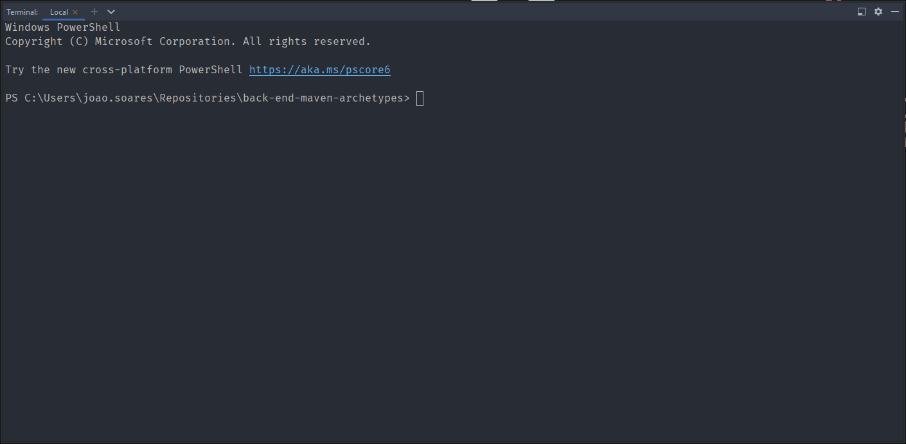
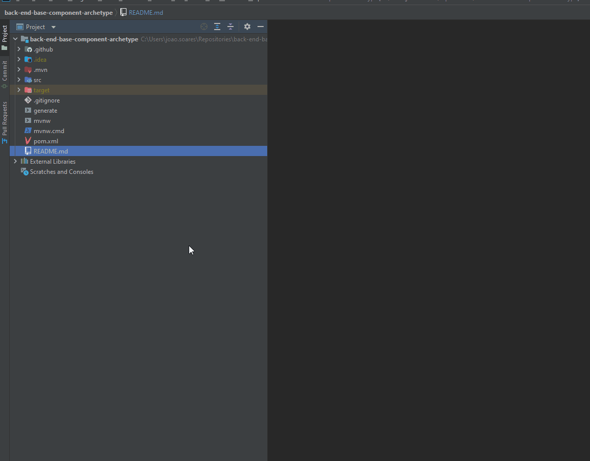

# <p align="center">Maven Archetypes</p>

<p align="center">
  <a href="https://github.com/angular/angular.js/blob/master/DEVELOPERS.md#type"></a>
</p>

## Table of Contents

* [What is this project for?](#what-is-this-project-for)
* [How to set up](#how-to-set-up)
    - [Set up's summary](#set-ups-summary)
    - [Configuration](#configuration)
* [Archetypes](#archetypes)
    - [Available archetypes](#available-archetypes)
    - [Generate new component from archetype](#generate-new-component-from-archetype)
        - [Quick command to create new component](#quick-command-to-create-new-component)
        - [Example of how to generate new component via terminal](#example-of-how-to-generate-new-component-via-terminal)
        - [Example of how to generate new component without terminal through Intellij](#example-of-how-to-generate-new-component-without-terminal-through-intellij)
* [How to create new archetypes](#how-to-create-new-archetypes)
* [FAQ](#faq)
    - [Common errors](#common-errors)
* [References](#references)

## What is this project for?

All back end maven archetypes to be used when creating a new component

## How to set up

### Set up's summary

Maven Archetypes is based on **Java 11**.

Requirements:

* For Java 11 use JVM OpenJ9
* Maven is embedded on this project with Maven Wrapper
* Git Version 2.34.1

### Configuration

1. #### Clone this repository

   ```console
   git clone https://github.com/amaroteam/back-end-maven-archetypes
   ```

2. #### Clean archetype target if exists

   ```console
   ./mvnw clean -f pom.xml
   ```

3. #### Install archetype target

   ```console
   ./mvnw install -f pom.xml
   ```

4. #### Update your Maven Archetype Catalog

   In order to archetype appears on the list of local archetypes it needs to exist on
   `~/.m2/repository/archetype-catalog.xml` file.

   Run the command below to update local catalog or create it (if it doesn't exist).

   ```console
   ./mvnw archetype:crawl
   ```

### Archetypes

#### Available archetypes

All archetypes are configured with:

* Archetype README template
* GitHub Actions pipelines
* Docker and/or Docker-Compose to deploy or run locally
* Unit tests

| group id      | archetype               | description                            | Main dependencies  |
|---------------|-------------------------|----------------------------------------|--------------------|
| com.amaro.ecp | kotlin-spring-boot-base | Basic archetype for REST API component | Spring Web         |

#### Generate new component from archetype

Before create a new component make sure you configured archetypes locally following [Configuration](#configuration)
section.

Choose an archetype from [Available archetypes](#available-archetypes) list.

Run command below on this project root folder after change the values to fit your needs.

> :information_source:
>
> After the wizard finish the process, a new folder will be created at this repository root folder with the new artifact name.
>
> Cut generated component folder else where and start your project from there.

_The command below will list all archetypes available in group id `com.amaro*`_ and starts the wizard.

_Select output directory of the new component. Usually is the same directory as this repository._

```console
./mvnw archetype:generate -Dfilter="com.amaro:" -DoutputDirectory="../"
```

_Archetype generation wizard properties description_

| property            | description                                      | value constraints           | value example             |
|---------------------|--------------------------------------------------|-----------------------------|---------------------------|
| archetypeGroupId    | Archetype group id                               | Lowercase separated by dot  | `com.amaro.ecp`           |
| archetypeArtifactId | Archetype artifact id                            | Lowercase separated by dash | `kotlin-spring-boot-base` |
| archetypeVersion    | Archetype version                                | Lowercase separated by dot  | `0.0.1-SNAPSHOT`          |
| groupId             | New component group id                           | Lowercase separated by dot  | `com.amaro.ecp`           |
| packagename         | New component package name                       | Lowercase separated by dot  | `com.amaro.ecp`           |
| artifactId          | New component artifact id                        | Lowercase separated by dash | `new-component-name`      |
| version             | New component version                            | Semantic versioning         | `0.0.1-SNAPSHOT`          |
| outputDirectory     | New component directory                          | Relative directory          | `../`                     |
| mainClassName       | New component main class name                    | Camelcase without spaces    | `NewComponentName`        |
| contextFolderName   | New component context folder name inside package | Lowercase without spaces    | `newcomponentname`        |

##### Quick command to create new component

_On Windows (cmd)_

```console
./mvnw archetype:generate ^
-DarchetypeGroupId="com.amaro.ecp" ^
-DarchetypeArtifactId="kotlin-spring-boot-base" ^
-DarchetypeVersion="0.0.1-SNAPSHOT" ^
-DgroupId="com.amaro.test" ^
-Dpackagename="com.amaro.test" ^
-DartifactId="my-new-component" ^
-Dversion="0.0.1-SNAPSHOT" ^
-DoutputDirectory="../"
```

_On Windows (Powershell)_

```console
./mvnw archetype:generate `
-DarchetypeGroupId="com.amaro.ecp" `
-DarchetypeArtifactId="kotlin-spring-boot-base" `
-DarchetypeVersion="0.0.1-SNAPSHOT" `
-DgroupId="com.amaro.test" `
-Dpackagename="com.amaro.test" `
-DartifactId="my-new-component" `
-Dversion="0.0.1-SNAPSHOT" `
-DoutputDirectory="../"
```

_On Linux and Mac_

```console
./mvnw archetype:generate \
-DarchetypeGroupId="com.amaro.ecp" \
-DarchetypeArtifactId="kotlin-spring-boot-base" \
-DarchetypeVersion="0.0.1-SNAPSHOT" \
-DgroupId="com.amaro.test" \
-Dpackagename="com.amaro.test" \
-DartifactId="my-new-component" \
-Dversion="0.0.1-SNAPSHOT" \
-DoutputDirectory="../"
```

##### Example of how to generate new component via terminal

<p align="center">
  
</p>

##### Example of how to generate new component without terminal through Intellij

TO BE IMPLEMENTED

---

## How to create new archetypes

_TO BE IMPLEMENTED_

## FAQ

### Common errors

1. #### Windows - JAVA_HOME is not set on Intellij terminal

   Follow the steps

   

---

## References

This archetype structure is based and inspired on

[:small_blue_diamond: Github | frtu | archetypes repository](https://github.com/frtu/archetypes)
